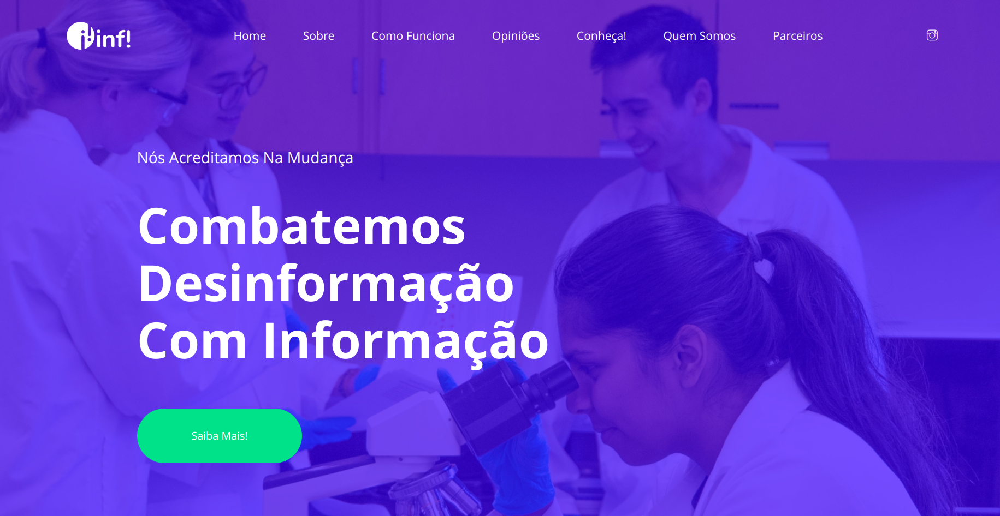
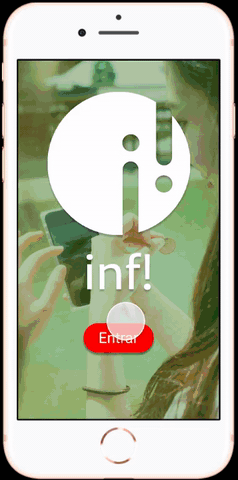

# Inf!

Este é um projeto do Hackathon [She Hacks 2019](https://shehacks.xyz/) com o desafio: Propondo soluções para a divulgação científica no Brasil

Time: 
- [Aline Speranza](https://www.linkedin.com/in/aline-speranza/)     
- [Amanda Kubo](https://www.linkedin.com/in/amandakubo/)    
- Mariana Pedroso    
- [Naiara Andrade](https://www.linkedin.com/in/naiara-andrade/)    

## Problema

## Solução

### O que é?

Protótipo do aplicativo Inf!

### Pra quem?

### Template

O template utilizado é gratuito com licença para uso e foi feito pela [Colorlib](https://colorlib.com/).

[Template Dizzi](https://colorlib.com/wp/template/dizzi/)    
[Github Template Dizzi](https://github.com/ColorlibHQ/dizzi)